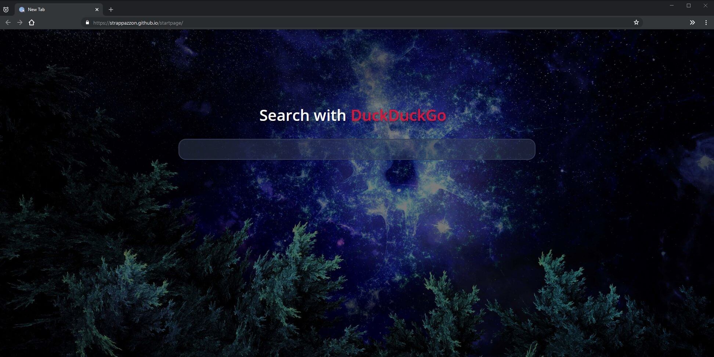

## Description

A startpage inspired by [this post on r/startpages](https://old.reddit.com/r/startpages/comments/9pwnwh/creation_my_first_try_at_a_personalized_start_page/). I wanted the startpage to be minimal so I did not include a dock (it's no use to me) and I replaced the time and date with a list of some available bangs (the date and time are on the taskbar anyway).

## Preview

## Usage

Go to <https://strappazzon.github.io/startpage/>

The default search engine is [DuckDuckGo](https://duckduckgo.com/). You can also search with any supported website\search engine by typing an exclamation mark followed by its corresponding letter, a space and your search query. For example:

- `!sp GitHub` would search Startpage for GitHub

This is a list of available bangs:

- !sp [Startpage](https://www.startpage.com/)
- !g [Google](https://www.google.com/)
- !w [Wikipedia](https://www.wikipedia.org/)
- ...and [12,758 more](https://duckduckgo.com/bang)

## Requirements

Just a modern browser whth JavaScript support.

## Credits

Wallpapers:

- [WallpapersCraft](https://wallpaperscraft.com/)
- [wallhaven](https://alpha.wallhaven.cc/)

Font:

- [Open Sans](https://fonts.google.com/specimen/Open+Sans)
